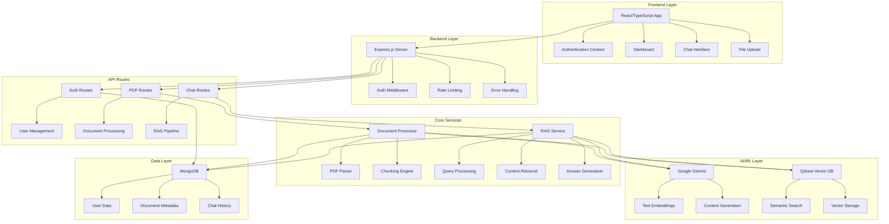
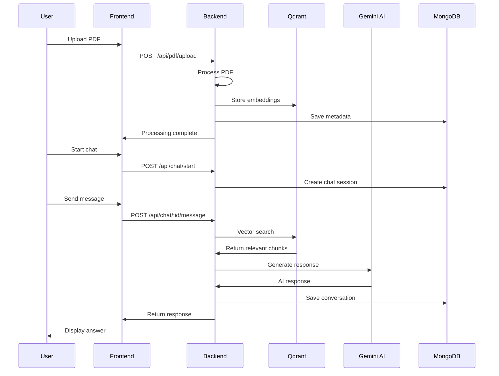

# 🤖 AskMyPDF - AI-Powered PDF Chat Application

[](https://opensource.org/licenses/MIT)
[](https://nodejs.org/)
[](https://reactjs.org/)
[](https://mongodb.com/)
[](https://qdrant.tech/)

> 🚀 **A modern full-stack MERN application that enables intelligent conversations with PDF documents using advanced RAG (Retrieval-Augmented Generation) pipeline powered by Google Gemini AI and Qdrant vector database.**

## 🌟 Features

### 📄 Document Processing
- **Multi-format Support**: PDF document processing with advanced text extraction
- **Intelligent Chunking**: Multiple chunking strategies (sentence, paragraph, semantic, hybrid)
- **Vector Embeddings**: Google Gemini text-embedding-004 for semantic search
- **Progress Tracking**: Real-time document processing status

### 🧠 AI-Powered Chat
- **RAG Pipeline**: Advanced Retrieval-Augmented Generation system
- **Hybrid Search**: Semantic + keyword search for optimal relevance
- **Context-Aware**: Maintains conversation history and context
- **Multi-language Support**: Automatic language detection and processing

### 🔒 Security & Authentication
- **JWT Authentication**: Secure user session management
- **Role-based Access**: Free and premium user tiers
- **Rate Limiting**: API protection against abuse
- **Data Encryption**: Secure password hashing with bcrypt

### 🎨 Modern UI/UX
- **Responsive Design**: Mobile-first design with Tailwind CSS
- **Real-time Updates**: Live chat interface with typing indicators
- **File Management**: Drag-and-drop file uploads with progress bars
- **Dark Mode Ready**: Modern glassmorphism design elements

## 🏗️ Architecture Overview



## 📊 System Flow



## 🚀 Quick Start

### Prerequisites
- 📦 Node.js 18+
- 🍃 MongoDB 6+
- 🔧 Docker (optional, for Qdrant)
- 🔑 Google Gemini API key

### 1. Clone Repository
```bash
git clone https://github.com/yourusername/askmypdf.git
cd askmypdf
```

### 2. Install Dependencies
```bash
npm run install:all
```

### 3. Setup Environment Variables

**Backend (.env):**
```bash
# Server Configuration
PORT=5000
NODE_ENV=development
FRONTEND_URL=http://localhost:5000

# Database
MONGODB_URI=mongodb://localhost:27017/pdfchat

# JWT
JWT_SECRET=your-super-secret-jwt-key-here

# Google Gemini API
GEMINI_API_KEY=your-gemini-api-key-here

# Qdrant Vector Database
QDRANT_URL=http://localhost:6333
QDRANT_API_KEY=your-qdrant-api-key-here
QDRANT_COLLECTION_NAME=pdf_documents
```

**Frontend (.env):**
```bash
VITE_API_URL=http://localhost:5000/api
```

### 4. Start Qdrant Vector Database
```bash
docker run -p 6333:6333 qdrant/qdrant
```

### 5. Start Development Servers
```bash
# Development mode (both frontend and backend)
npm run dev

# Or start separately
npm run dev:backend
npm run dev:frontend
```

### 6. Production Build
```bash
npm run build
npm start
```

## 📁 Project Structure

```
AskMyPDF/
├── 📁 backend/                 # Express.js backend
│   ├── 📁 middleware/          # Authentication, error handling
│   ├── 📁 models/             # MongoDB schemas
│   ├── 📁 routes/             # API route handlers
│   ├── 📁 services/           # Business logic services
│   └── 📄 server.js           # Express server entry point
├── 📁 frontend/               # React frontend
│   ├── 📁 src/
│   │   ├── 📁 components/     # Reusable React components
│   │   ├── 📁 contexts/       # React contexts
│   │   ├── 📁 pages/          # Route components
│   │   └── 📁 services/       # API service layer
│   └── 📄 vite.config.ts      # Vite configuration
├── 📄 package.json            # Root package configuration
└── 📄 README.md              # This file
```

## 🛠️ Technology Stack

### Frontend Technologies
- **⚛️ React 18**: Modern UI library with hooks
- **📘 TypeScript**: Type-safe JavaScript
- **🎨 Tailwind CSS**: Utility-first CSS framework
- **🚀 Vite**: Fast development build tool
- **📱 React Router**: Client-side routing
- **🔄 React Query**: Data fetching and caching
- **📋 React Dropzone**: File upload handling
- **🔥 React Hot Toast**: Notifications

### Backend Technologies
- **🟢 Node.js**: JavaScript runtime
- **⚡ Express.js**: Web application framework
- **🍃 MongoDB**: NoSQL database with Mongoose ODM
- **🔐 JWT**: JSON Web Tokens for authentication
- **🛡️ bcrypt**: Password hashing
- **📊 Multer**: File upload middleware
- **🚦 Rate Limiting**: API protection

### AI/ML Technologies
- **🤖 Google Gemini**: AI model for embeddings and generation
- **🔍 Qdrant**: Vector database for semantic search
- **📄 PDF-Parse**: PDF text extraction
- **🧠 RAG Pipeline**: Retrieval-Augmented Generation

## 🔧 API Documentation

### Authentication Endpoints
- `POST /api/auth/register` - User registration
- `POST /api/auth/login` - User login
- `GET /api/auth/me` - Get current user
- `PUT /api/auth/profile` - Update user profile

### Document Endpoints
- `POST /api/pdf/upload` - Upload PDF document
- `GET /api/pdf/documents` - List user documents
- `GET /api/pdf/documents/:id` - Get document details
- `DELETE /api/pdf/documents/:id` - Delete document

### Chat Endpoints
- `POST /api/chat/start` - Start new chat session
- `POST /api/chat/:id/message` - Send message
- `GET /api/chat/:id` - Get chat history
- `DELETE /api/chat/:id` - Delete chat session

## 📈 Performance Optimizations

### Backend Optimizations
- **🚀 Vector Indexing**: Efficient similarity search with Qdrant
- **📊 Database Indexing**: Optimized MongoDB queries
- **🔄 Caching**: Response caching for frequently accessed data
- **⚡ Async Processing**: Background PDF processing
- **📦 Compression**: Response compression middleware

### Frontend Optimizations
- **🎯 Code Splitting**: Lazy loading of route components
- **🔄 React Query**: Intelligent data caching and synchronization
- **📱 Responsive Design**: Mobile-first approach
- **⚡ Bundle Optimization**: Vite's efficient bundling

## 🔒 Security Features

- **🔐 JWT Authentication**: Secure token-based authentication
- **🛡️ Password Hashing**: bcrypt with salt rounds
- **🚦 Rate Limiting**: Prevent API abuse
- **🔍 Input Validation**: Express validator middleware
- **🛡️ Helmet**: Security headers middleware
- **🔒 CORS**: Cross-origin resource sharing configuration

## 🌍 Environment Support

- **🔧 Development**: Hot reloading, source maps, debug logging
- **🏭 Production**: Optimized builds, compression, security headers
- **🐳 Docker**: Container support for easy deployment
- **☁️ Cloud**: AWS, Google Cloud, Azure compatible

## 🤝 Contributing

1. Fork the repository
2. Create a feature branch (`git checkout -b feature/amazing-feature`)
3. Commit your changes (`git commit -m 'Add some amazing feature'`)
4. Push to the branch (`git push origin feature/amazing-feature`)
5. Open a Pull Request

## 📄 License

This project is licensed under the MIT License - see the [LICENSE](LICENSE) file for details.

## 🙏 Acknowledgments

- **Google Gemini**: For providing advanced AI capabilities
- **Qdrant**: For efficient vector database operations
- **MongoDB**: For flexible document storage
- **React Community**: For excellent documentation and tools

## 📞 Support

For support, email support@askmypdf.com or join our [Discord community](https://discord.gg/askmypdf).

---

<div align="center">
  <strong>🚀 Built with ❤️ using modern web technologies</strong>
</div>
