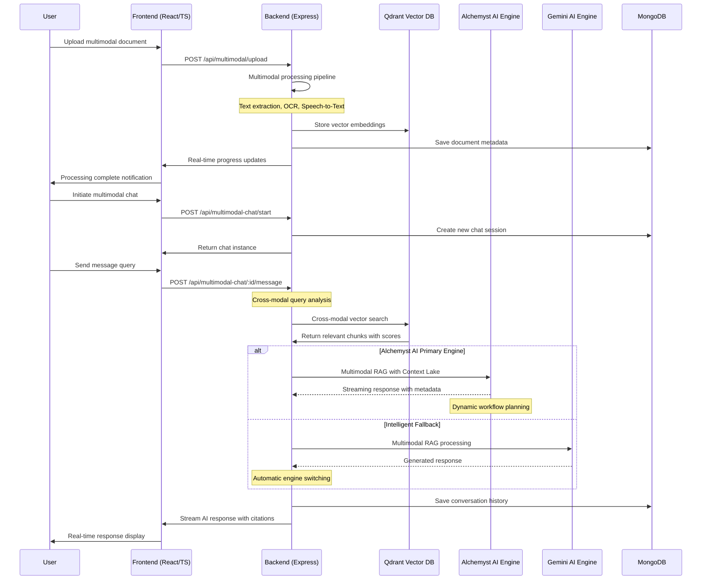

# 🤖 AskMyPDF - AI-Powered PDF Chat Application

[](https://opensource.org/licenses/MIT)
[](https://nodejs.org/)
[](https://reactjs.org/)
[](https://www.typescriptlang.org/)
[](https://mongodb.com/)
[](https://qdrant.tech/)
[](https://alchemyst.ai/)
[](https://gemini.google.com/)
[](https://www.framer.com/motion/)
[](https://tailwindcss.com/)

> 🚀 **A cutting-edge full-stack MERN application with TypeScript that revolutionizes PDF interaction through intelligent conversations. Features an advanced dual AI engine architecture (Alchemyst AI with dynamic workflow planning + Google Gemini fallback), sophisticated RAG pipeline, Qdrant vector database, and a stunning glassmorphism UI with real-time streaming responses.**

## 🌟 Features

### 📄 **Advanced Document Processing**
- **Multi-format Support**: PDF, DOCX, images (JPG, PNG, GIF), and audio files (MP3, WAV, M4A)
- **Multimodal Processing**: Unified processing pipeline for text, visual, and audio content
- **Intelligent Chunking**: Multiple strategies (sentence, paragraph, semantic, hybrid)
- **OCR Integration**: Text extraction from images using Google Gemini Vision
- **Speech-to-Text**: Audio transcription with timestamp tracking
- **Vector Embeddings**: Google Gemini text-embedding-004 for semantic search
- **Progress Tracking**: Real-time document processing with status updates
- **Metadata Extraction**: Comprehensive document analysis including page count, word count
- **Language Detection**: Automatic text language identification
- **Cross-Modal Linking**: Intelligent connections between different content types

### 🧠 **Dual AI Engine Architecture with Advanced RAG**
- **Primary Engine**: Alchemyst AI with dynamic workflow planning and Context Lake integration
- **Fallback Engine**: Google Gemini 2.0 Flash for maximum reliability
- **Intelligent Switching**: Automatic failover with real-time health monitoring
- **Advanced RAG Pipeline**: Enhanced Retrieval-Augmented Generation system
- **Multimodal RAG**: Cross-modal semantic search and retrieval
- **Query Expansion**: AI-powered query enhancement for better retrieval
- **Context-Aware Responses**: Maintains conversation history and document context
- **Streaming Responses**: Real-time token streaming for instant feedback
- **Engine Status Monitoring**: Live tracking via `/api/chat/engine-status` endpoint

### 🔍 **Enhanced Vector Search & Database**
- **Qdrant Integration**: High-performance vector database with collection management
- **Hybrid Search**: Semantic + keyword search with advanced filtering
- **Batch Operations**: Efficient bulk vector operations
- **Real-time Analytics**: Comprehensive search result evaluation
- **Document-Specific Filtering**: Precise vector search within documents
- **Cross-Modal Search**: Search across text, image, and audio content simultaneously
- **Caching Layer**: Optimized performance with intelligent caching

### 🎨 **Modern Glassmorphism UI/UX**
- **TypeScript React Frontend**: Type-safe React 18 with Vite build system
- **Glassmorphism Design**: Beautiful backdrop-blur effects and transparency
- **Framer Motion Animations**: Smooth, engaging micro-interactions
- **Dark Mode Support**: Adaptive theming with seamless transitions
- **Responsive Design**: Mobile-first approach with Tailwind CSS
- **Real-time Chat Interface**: Markdown support with syntax highlighting
- **Animated Components**: Custom animated buttons and loading states
- **Floating UI Elements**: Dynamic background animations
- **Multimodal Interface**: Specialized UI for different content types
- **Citation System**: Transparent source attribution with modality indicators

### 🔒 **Enterprise-Grade Security & Authentication**
- **JWT Authentication**: Secure token-based user session management
- **User Tiers**: Free (50 messages/month) and Premium (1000 messages/month)
- **Rate Limiting**: API protection against abuse and spam
- **Input Validation**: Comprehensive data sanitization with express-validator
- **Password Security**: bcrypt hashing with salt rounds
- **CORS Protection**: Configurable cross-origin request security
- **Error Handling**: Secure error responses without sensitive data exposure

### 📊 **Advanced Analytics & Monitoring**
- **Processing Metrics**: Detailed performance analytics for all operations
- **AI Engine Health**: Real-time monitoring of both Alchemyst and Gemini engines
- **Token Usage Tracking**: Comprehensive usage analytics per user
- **Response Time Monitoring**: Performance metrics for optimization
- **Error Tracking**: Detailed error logging and reporting
- **User Usage Statistics**: Monthly usage tracking and limits
- **Multimodal Analytics**: Processing metrics across different content types

## 🏗️ Architecture Overview



```mermaid
graph TB
    subgraph "Frontend Layer"
        A[React/TypeScript App] --> B[Authentication Context]
        A --> C[Glassmorphism Dashboard]
        A --> D[Real-time Chat Interface]
        A --> E[Animated File Upload]
        A --> F[Dark Mode Theme]
        A --> G[Multimodal Dashboard]
        A --> H[Cross-Modal Search]
    end
    
    subgraph "Backend API Layer"
        I[Express.js Server] --> J[JWT Auth Middleware]
        I --> K[Rate Limiting]
        I --> L[Error Handling]
        I --> M[Input Validation]
    end
    
    subgraph "Route Handlers"
        N[Auth Routes] --> O[User Management]
        P[PDF Routes] --> Q[Document Processing]
        R[Chat Routes] --> S[Dual AI RAG Pipeline]
        R --> T[Engine Status Monitor]
        U[Multimodal Routes] --> V[Cross-Format Processing]
        W[Multimodal Chat] --> X[Cross-Modal RAG]
    end
    
    subgraph "Dual AI Engine System"
        Y[Alchemyst AI Primary] --> Z[Dynamic Workflow Planning]
        Y --> AA[Context Lake Integration]
        BB[Google Gemini Fallback] --> CC[Reliable Processing]
        DD[Engine Health Monitor] --> EE[Automatic Failover]
    end
    
    subgraph "Enhanced RAG Pipeline"
        FF[Query Preprocessing] --> GG[Query Expansion]
        GG --> HH[Hybrid Retrieval]
        HH --> II[Context Ranking]
        II --> JJ[Response Generation]
        JJ --> KK[Streaming Output]
        LL[Cross-Modal Retrieval] --> MM[Modality Fusion]
    end
    
    subgraph "Vector Database Layer"
        NN[Qdrant Vector DB] --> OO[Semantic Search]
        NN --> PP[Document Filtering]
        NN --> QQ[Batch Operations]
        NN --> RR[Collection Management]
    end
    
    subgraph "Multimodal Processing"
        SS[Image Analysis] --> TT[OCR Extraction]
        SS --> UU[Visual Description]
        VV[Audio Processing] --> WW[Speech-to-Text]
        VV --> XX[Timestamp Tracking]
        YY[Cross-Modal Links] --> ZZ[Semantic Connections]
    end
    
    subgraph "Data Layer"
        AAA[MongoDB] --> BBB[User Profiles]
        AAA --> CCC[Document Metadata]
        AAA --> DDD[Chat History]
        AAA --> EEE[Usage Analytics]
        AAA --> FFF[Multimodal Documents]
    end
    
    A --> I
    S --> Y
    S --> BB
    HH --> NN
    JJ --> AAA
    DD --> Y
    DD --> BB
    V --> SS
    V --> VV
    X --> LL
```

## 📊 System Flow



## 🚀 Quick Start

### Prerequisites
- 📦 Node.js 18+
- 🍃 MongoDB 6+
- 🔧 Docker (optional, for Qdrant)
- 🔑 Google Gemini API key
- 🧪 Alchemyst AI API key (optional, for enhanced features)
- 🎵 FFmpeg (for audio processing)

### 1. Clone Repository
```bash
git clone https://github.com/yourusername/askmypdf.git
cd askmypdf
```

### 2. Install Dependencies
```bash
npm run install:all
```

### 3. Setup Environment Variables

**Backend (.env):**
```bash
# Server Configuration
PORT=5000
NODE_ENV=development
FRONTEND_URL=http://localhost:5000

# Database
MONGODB_URI=mongodb://localhost:27017/pdfchat

# JWT
JWT_SECRET=your-super-secret-jwt-key-here

# Google Gemini API (Required - Fallback Engine)
GEMINI_API_KEY=your-gemini-api-key-here

# Alchemyst AI API (Optional - Primary Engine for Enhanced Features)
ALCHEMYST_API_KEY=your-alchemyst-api-key-here
ALCHEMYST_API_URL=https://platform-backend.getalchemystai.com/api/v1

# Qdrant Vector Database
QDRANT_URL=http://localhost:6333
QDRANT_API_KEY=your-qdrant-api-key-here
QDRANT_COLLECTION_NAME=multimodal_documents
```

**Frontend (.env):**
```bash
VITE_API_URL=http://localhost:5000/api
```

### 4. Start Qdrant Vector Database
```bash
docker run -p 6333:6333 qdrant/qdrant
```

### 5. Start Development Servers
```bash
# Development mode (both frontend and backend)
npm run dev

# Or start separately
npm run dev:backend
npm run dev:frontend
```

### 6. Production Build
```bash
npm run build
npm start
```

## 📁 Project Structure

```
AskMyPDF/
├── 📁 backend/                 # Express.js backend
│   ├── 📁 middleware/          # Authentication, error handling
│   ├── 📁 models/             # MongoDB schemas
│   │   ├── 📄 MultimodalDocument.js # Enhanced document model
│   ├── 📁 routes/             # API route handlers
│   │   ├── 📄 multimodal.js   # Multimodal document routes
│   │   └── 📄 multimodalChat.js # Cross-modal chat routes
│   ├── 📁 services/           # Business logic services
│   │   ├── 📄 multimodalProcessor.js # Cross-format processing
│   │   └── 📄 multimodalRAGService.js # Cross-modal RAG
│   └── 📄 server.js           # Express server entry point
├── 📁 frontend/               # React frontend
│   ├── 📁 src/
│   │   ├── 📁 components/     # Reusable React components
│   │   │   └── 📄 MultimodalFileUpload.tsx # Enhanced upload
│   │   ├── 📁 contexts/       # React contexts
│   │   ├── 📁 pages/          # Route components
│   │   │   ├── 📄 MultimodalDashboard.tsx # Multimodal interface
│   │   │   └── 📄 MultimodalChat.tsx # Cross-modal chat
│   │   └── 📁 services/       # API service layer
│   └── 📄 vite.config.ts      # Vite configuration
├── 📄 package.json            # Root package configuration
└── 📄 README.md              # This file
```

## 🛠️ Technology Stack

### Frontend Technologies
- **⚛️ React 18**: Modern UI library with hooks
- **📘 TypeScript**: Type-safe JavaScript
- **🎨 Tailwind CSS**: Utility-first CSS framework
- **🚀 Vite**: Fast development build tool
- **📱 React Router**: Client-side routing
- **🔄 React Query**: Data fetching and caching
- **📋 React Dropzone**: File upload handling
- **🔥 React Hot Toast**: Notifications

### Backend Technologies
- **🟢 Node.js**: JavaScript runtime
- **⚡ Express.js**: Web application framework
- **🍃 MongoDB**: NoSQL database with Mongoose ODM
- **🔐 JWT**: JSON Web Tokens for authentication
- **🛡️ bcrypt**: Password hashing
- **📊 Multer**: File upload middleware
- **🚦 Rate Limiting**: API protection

### AI/ML Technologies
- **🤖 Alchemyst AI**: Primary AI engine with dynamic workflow planning and Context Lake
- **🤖 Google Gemini**: Fallback AI model for embeddings and generation
- **👁️ Gemini Vision**: Image analysis and OCR capabilities
- **🎵 Whisper**: Speech-to-text transcription (integration ready)
- **🔍 Qdrant**: Vector database for semantic search
- **📄 PDF-Parse**: PDF text extraction
- **📄 Mammoth**: DOCX document processing
- **🖼️ Sharp**: Image processing and optimization
- **🎵 FFmpeg**: Audio format conversion and processing
- **🧠 Enhanced RAG Pipeline**: Dual-engine Retrieval-Augmented Generation
- **🔗 Cross-Modal RAG**: Unified semantic search across content types
- **⚡ Intelligent Fallback**: Automatic engine switching for reliability
- **📊 Engine Monitoring**: Real-time AI engine health tracking

## 🔧 API Documentation

### Authentication Endpoints
- `POST /api/auth/register` - User registration
- `POST /api/auth/login` - User login
- `GET /api/auth/me` - Get current user
- `PUT /api/auth/profile` - Update user profile

### Document Endpoints
- `POST /api/pdf/upload` - Upload PDF document
- `POST /api/multimodal/upload` - Upload multimodal document (PDF, DOCX, images, audio)
- `GET /api/pdf/documents` - List user documents
- `GET /api/multimodal/documents` - List multimodal documents with filtering
- `GET /api/pdf/documents/:id` - Get document details
- `GET /api/multimodal/documents/:id` - Get multimodal document details
- `DELETE /api/pdf/documents/:id` - Delete document
- `DELETE /api/multimodal/documents/:id` - Delete multimodal document
- `POST /api/multimodal/search` - Cross-modal search across documents

### Chat Endpoints
- `POST /api/chat/start` - Start new chat session
- `POST /api/multimodal-chat/start` - Start multimodal chat session
- `POST /api/chat/:id/message` - Send message with dual AI engine support
- `POST /api/multimodal-chat/:id/message` - Send message with cross-modal RAG
- `GET /api/chat/:id` - Get chat history with metadata
- `GET /api/multimodal-chat/:id` - Get multimodal chat with cross-modal info
- `GET /api/chat/user/chats` - List user chat sessions
- `DELETE /api/chat/:id` - Delete chat session
- `POST /api/chat/:id/follow-up` - Generate AI-powered follow-up questions
- `POST /api/multimodal-chat/:id/follow-up` - Generate cross-modal follow-up questions
- `POST /api/chat/:id/evaluate` - Evaluate response quality metrics
- `POST /api/chat/:id/search` - Advanced search within document using Qdrant
- `POST /api/multimodal-chat/:id/search` - Cross-modal search within document
- `GET /api/chat/engine-status` - **NEW**: Real-time AI engine status and health monitoring
- `GET /api/multimodal-chat/:id/citations` - Get citations with modality information

## 📈 Performance Optimizations

### Backend Optimizations
- **🚀 Vector Indexing**: Efficient similarity search with Qdrant
- **🧪 Dual AI Engine**: Primary Alchemyst AI with Gemini fallback
- **🔄 Intelligent Fallback**: Automatic engine switching for reliability
- **🔗 Cross-Modal Indexing**: Unified indexing across content types
- **📊 Database Indexing**: Optimized MongoDB queries
- **🔄 Caching**: Response caching for frequently accessed data
- **⚡ Async Processing**: Background PDF processing
- **🎵 Audio Optimization**: Efficient audio format conversion
- **🖼️ Image Optimization**: Smart image resizing and compression
- **📦 Compression**: Response compression middleware
- **🔍 Hybrid Search**: Semantic + keyword search combination
- **🔗 Cross-Modal Search**: Simultaneous search across all modalities

## 🧪 Testing & Development

### Alchemyst AI Testing
```bash
# Test Alchemyst AI integration
cd backend
npm run test:alchemyst

# Test multimodal processing
npm run test:multimodal
```

This will verify:
- ✅ Service configuration and API key setup
- ✅ Connection to Alchemyst AI platform
- ✅ Health check and response generation
- ✅ Fallback mechanism to Gemini AI
- ✅ Multimodal document processing
- ✅ Cross-modal search functionality
- ✅ OCR and speech-to-text integration

### Development Scripts
```bash
# Install all dependencies
npm run install:all

# Start development servers
npm run dev

# Start backend only
npm run dev:backend

# Start frontend only  
npm run dev:frontend

# Run production build
npm run build
npm start
```

### Performance Optimizations

#### Backend Optimizations
- **🚀 Vector Indexing**: Efficient similarity search with Qdrant
- **🔗 Cross-Modal Indexing**: Unified semantic indexing
- **📊 Connection Pooling**: MongoDB connection optimization
- **⚡ Batch Processing**: Bulk operations for document processing
- **🎵 Audio Processing**: Efficient transcription pipelines
- **🖼️ Image Processing**: Optimized OCR and visual analysis
- **🔄 Caching**: Intelligent caching for frequently accessed data

#### Frontend Optimizations
- **🎯 Code Splitting**: Lazy loading of route components
- **🔄 React Query**: Intelligent data caching and synchronization
- **📱 Responsive Design**: Mobile-first approach with optimized assets
- **⚡ Bundle Optimization**: Vite's efficient bundling with tree shaking
- **🎨 Multimodal UI**: Specialized interfaces for different content types
- **🔗 Cross-Modal Navigation**: Seamless switching between content types

## 🔒 Security Features

- **🔐 JWT Authentication**: Secure token-based authentication with refresh tokens
- **🛡️ Password Hashing**: bcrypt with configurable salt rounds
- **🚦 Rate Limiting**: Advanced API protection against abuse and DDoS
- **🔍 Input Validation**: Comprehensive Express validator middleware
- **🛡️ Helmet**: Security headers middleware for XSS protection
- **🔒 CORS**: Configurable cross-origin resource sharing
- **🔐 API Key Security**: Secure handling of AI service credentials
- **📁 File Type Validation**: Comprehensive file format verification
- **🔍 Content Scanning**: Security checks for uploaded content

## 🌍 Environment Support

- **🔧 Development**: Hot reloading, source maps, debug logging, AI engine monitoring
- **🏭 Production**: Optimized builds, compression, security headers, error tracking
- **🐳 Docker**: Container support with multi-stage builds for easy deployment
- **☁️ Cloud**: AWS, Google Cloud, Azure compatible with environment-specific configs
- **📊 Monitoring**: Real-time AI engine health monitoring and performance metrics
- **🔗 Multimodal Support**: Cross-platform compatibility for all content types

## 🤝 Contributing

1. Fork the repository
2. Create a feature branch (`git checkout -b feature/amazing-feature`)
3. Commit your changes (`git commit -m 'Add some amazing feature'`)
4. Push to the branch (`git push origin feature/amazing-feature`)
5. Open a Pull Request

## 📄 License

This project is licensed under the MIT License - see the [LICENSE](LICENSE) file for details.

## 🙏 Acknowledgments

- **Alchemyst AI**: For providing advanced AI capabilities with dynamic workflow planning
- **Google Gemini**: For reliable AI capabilities and embeddings
- **Google Gemini Vision**: For advanced image analysis and OCR
- **Qdrant**: For efficient vector database operations
- **MongoDB**: For flexible document storage
- **React Community**: For excellent documentation and tools
- **FFmpeg**: For robust audio processing capabilities
- **Sharp**: For efficient image processing

## 🧪 Testing & Development

### Backend Testing
```bash
# Run Alchemyst AI integration test
cd backend
npm run test:alchemyst

# Run multimodal processing tests
npm run test:multimodal

# Run all backend tests
npm test
```

### Engine Status Monitoring
The application includes built-in AI engine monitoring:
- Real-time health checks for both AI engines
- Automatic fallback detection
- Performance metrics tracking
- Engine status API endpoint: `GET /api/chat/engine-status`
- Cross-modal processing monitoring
- Multimodal search performance metrics

## 📞 Support & Contact

For support or questions, feel free to reach out:

- 📧 **Email**: [sakshamsinghrathore1304@gmail.com](mailto:sakshamsinghrathore1304@gmail.com)
- 💼 **LinkedIn**: [Saksham Singh Rathore](https://www.linkedin.com/in/saksham-singh-rathore1304/)
- 🐛 **Issues**: Found a bug or have a feature request? Please [open an issue](https://github.com/saksham-1304/AskMyPDF/issues) on GitHub
- 💡 **Discussions**: Join the conversation in our [GitHub Discussions](https://github.com/saksham-1304/AskMyPDF/discussions)

---

<div align="center">
  <strong>🚀 Built with ❤️ using modern web technologies</strong>
</div>