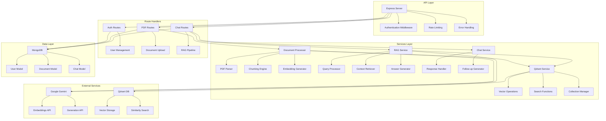
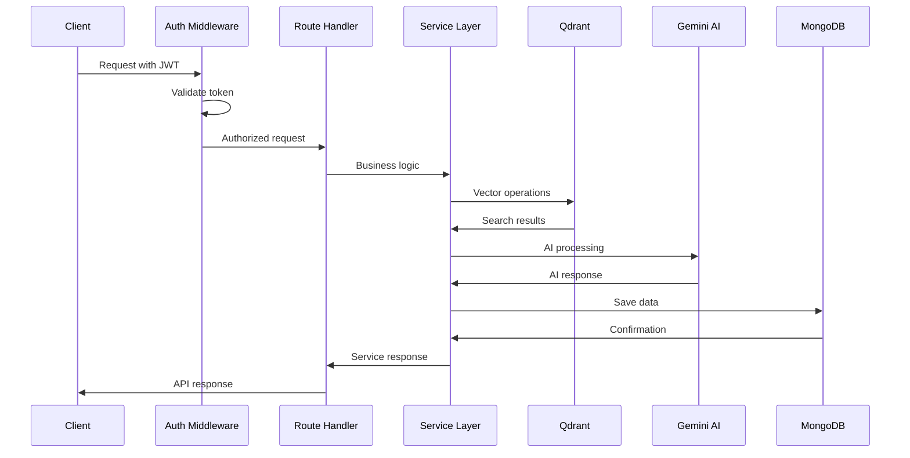
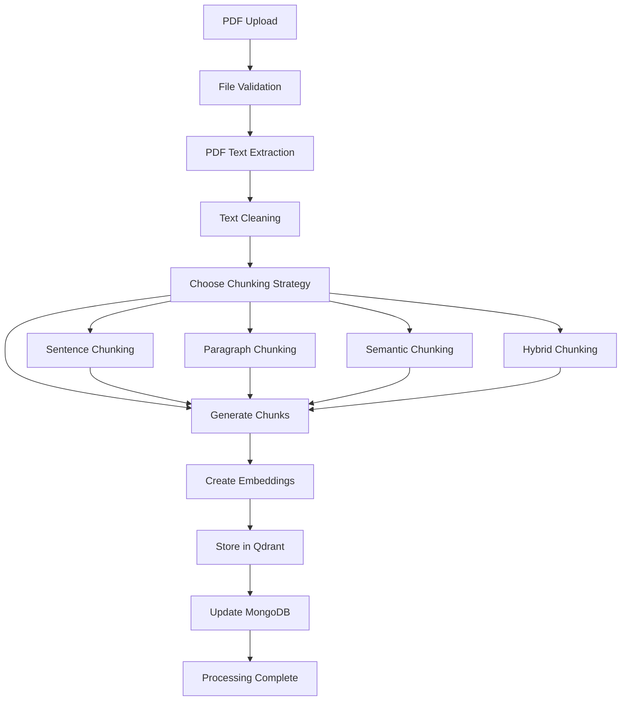
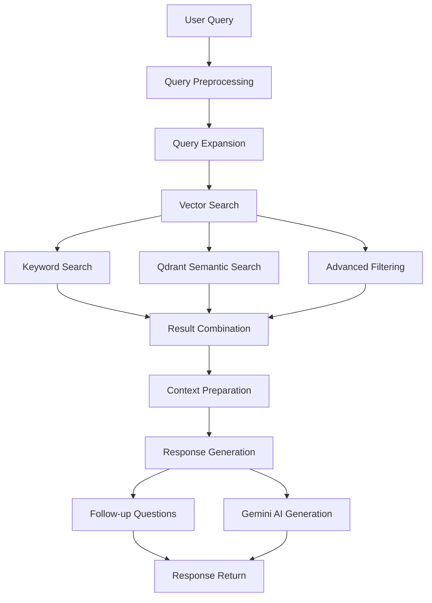

# 🖥️ AskMyPDF Backend

[](https://nodejs.org/)
[](https://expressjs.com/)
[](https://mongodb.com/)
[](https://qdrant.tech/)

> 🚀 **Robust Express.js backend with advanced RAG pipeline, vector search, and AI-powered document processing using Google Gemini and Qdrant vector database.**

## 🌟 Features

### 🔐 Authentication & Security
- **JWT-based Authentication**: Secure token management
- **Password Hashing**: bcrypt with salt rounds
- **Rate Limiting**: API protection against abuse
- **Input Validation**: Express validator middleware
- **Security Headers**: Helmet middleware for security

### 📄 Document Processing
- **PDF Processing**: Advanced text extraction with pdf-parse
- **Chunking Strategies**: Multiple approaches (sentence, paragraph, semantic, hybrid)
- **Vector Embeddings**: Google Gemini text-embedding-004
- **Progress Tracking**: Real-time processing status updates

### 🧠 RAG Pipeline
- **Hybrid Search**: Semantic + keyword search
- **Context Retrieval**: Intelligent chunk selection
- **Query Expansion**: AI-powered query enhancement
- **Response Generation**: Google Gemini 2.0 Flash

### 🔍 Vector Database
- **Qdrant Integration**: High-performance vector search
- **Collection Management**: Automatic collection creation
- **Filtering**: Document-specific vector filtering
- **Batch Operations**: Efficient bulk operations

## 🏗️ Architecture



## 📊 Request Flow



## 🚀 Getting Started

### Prerequisites
- 📦 Node.js 18+
- 🍃 MongoDB 6+
- 🔧 Docker (for Qdrant)
- 🔑 Google Gemini API key

### Installation
```bash
cd backend
npm install
```

### Environment Configuration
Create a `.env` file:
```bash
# Server Configuration
PORT=5000
NODE_ENV=development
FRONTEND_URL=http://localhost:5000

# Database
MONGODB_URI=mongodb://localhost:27017/pdfchat

# JWT
JWT_SECRET=your-super-secret-jwt-key-here

# Google Gemini API
GEMINI_API_KEY=your-gemini-api-key-here

# Qdrant Vector Database
QDRANT_URL=http://localhost:6333
QDRANT_API_KEY=your-qdrant-api-key-here
QDRANT_COLLECTION_NAME=pdf_documents
```

### Start Development Server
```bash
npm run dev
```

### Production Build
```bash
npm start
```

## 📁 Project Structure

```
backend/
├── 📁 middleware/              # Express middleware
│   ├── 📄 auth.js             # JWT authentication
│   └── 📄 errorHandler.js     # Global error handling
├── 📁 models/                 # MongoDB schemas
│   ├── 📄 Chat.js             # Chat session model
│   ├── 📄 Document.js         # Document metadata model
│   └── 📄 User.js             # User model
├── 📁 routes/                 # API route handlers
│   ├── 📄 auth.js             # Authentication routes
│   ├── 📄 chat.js             # Chat management routes
│   └── 📄 pdf.js              # Document processing routes
├── 📁 services/               # Business logic layer
│   ├── 📄 chatService.js      # Chat operations
│   ├── 📄 documentProcessor.js # PDF processing
│   ├── 📄 gemini.js           # Google Gemini client
│   ├── 📄 pdfService.js       # PDF service interface
│   ├── 📄 qdrantService.js    # Vector database operations
│   └── 📄 ragService.js       # RAG pipeline
├── 📁 public/                 # Static files (built frontend)
├── 📁 uploads/                # Temporary file uploads
├── 📄 package.json            # Dependencies and scripts
└── 📄 server.js               # Express server entry point
```

## 🛠️ Core Services

### 📄 Document Processor
```javascript
class DocumentProcessor {
  // PDF text extraction
  async extractPDFContent(filePath)
  
  // Multiple chunking strategies
  sentenceBasedChunking(text, numPages)
  paragraphBasedChunking(text, numPages)
  semanticChunking(text, numPages)
  hybridChunking(text, numPages)
  
  // Embedding generation
  async generateChunkEmbeddings(chunks)
}
```

### 🧠 RAG Service
```javascript
class RAGService {
  // Main pipeline
  async generateResponse(query, document, chatHistory)
  
  // Query processing
  async preprocessQuery(query, chatHistory)
  
  // Hybrid retrieval
  async retrieveRelevantChunks(query, document)
  
  // Response generation
  async generateAnswer(query, context, chatHistory)
}
```

### 🔍 Qdrant Service
```javascript
// Vector operations
export const storeQdrantVectors = async (chunks, collectionName, documentId)
export const searchSimilarChunks = async (query, collectionName, topK)
export const searchWithFilter = async (query, collectionName, documentId)
export const advancedSearch = async (query, collectionName, options)
```

## 🔌 API Endpoints

### Authentication
| Method | Endpoint | Description |
|--------|----------|-------------|
| POST | `/api/auth/register` | User registration |
| POST | `/api/auth/login` | User login |
| GET | `/api/auth/me` | Get current user |
| PUT | `/api/auth/profile` | Update profile |

### Document Management
| Method | Endpoint | Description |
|--------|----------|-------------|
| POST | `/api/pdf/upload` | Upload PDF document |
| GET | `/api/pdf/documents` | List user documents |
| GET | `/api/pdf/documents/:id` | Get document details |
| DELETE | `/api/pdf/documents/:id` | Delete document |
| GET | `/api/pdf/documents/:id/analytics` | Document analytics |

### Chat Operations
| Method | Endpoint | Description |
|--------|----------|-------------|
| POST | `/api/chat/start` | Start new chat |
| POST | `/api/chat/:id/message` | Send message |
| GET | `/api/chat/:id` | Get chat history |
| GET | `/api/chat/user/chats` | List user chats |
| DELETE | `/api/chat/:id` | Delete chat |
| POST | `/api/chat/:id/follow-up` | Generate follow-up questions |

## 📊 Data Models

### User Model
```javascript
{
  username: String,
  email: String,
  password: String (hashed),
  plan: "free" | "premium",
  usage: {
    documentsUploaded: Number,
    messagesThisMonth: Number,
    lastResetDate: Date
  }
}
```

### Document Model
```javascript
{
  userId: ObjectId,
  filename: String,
  originalName: String,
  size: Number,
  content: String,
  chunks: [ChunkSchema],
  processingStatus: "uploading" | "processing" | "completed" | "failed",
  processingProgress: Number,
  metadata: {
    pages: Number,
    wordCount: Number,
    chunkingStrategy: String
  },
  qdrantCollection: String
}
```

### Chat Model
```javascript
{
  userId: ObjectId,
  documentId: ObjectId,
  title: String,
  messages: [MessageSchema],
  isActive: Boolean
}
```

## 🔄 Processing Pipeline

### Document Processing Flow


### RAG Pipeline Flow


## 🔧 Configuration

### Chunking Strategies
- **Sentence**: Splits text by sentences (good for Q&A)
- **Paragraph**: Splits by paragraphs (better context)
- **Semantic**: Topic-based splitting (intelligent grouping)
- **Hybrid**: Combines multiple strategies (optimal)

### Vector Database Settings
```javascript
// Qdrant collection configuration
{
  vectors: {
    size: 768,        // Gemini embedding dimension
    distance: 'Cosine' // Similarity metric
  },
  optimizers_config: {
    default_segment_number: 2
  }
}
```

## 🚀 Performance Optimizations

### Vector Search
- **Batch Processing**: Efficient bulk operations
- **Filtering**: Document-specific searches
- **Caching**: Collection info caching
- **Indexing**: Payload field indexing

### Database Operations
- **Connection Pooling**: MongoDB connection optimization
- **Indexing**: Strategic field indexing
- **Aggregation**: Efficient data aggregation
- **Pagination**: Large dataset handling

## 🔒 Security Features

### Authentication
- **JWT Tokens**: Secure session management
- **Password Hashing**: bcrypt with salt rounds
- **Token Validation**: Middleware protection
- **Session Management**: Automatic token refresh

### API Protection
- **Rate Limiting**: Request throttling
- **Input Validation**: Data sanitization
- **Error Handling**: Secure error responses
- **CORS Configuration**: Origin validation

## 🧪 Testing

### Unit Tests
```bash
npm test
```

### API Testing
```bash
# Test authentication
curl -X POST http://localhost:5000/api/auth/login \
  -H "Content-Type: application/json" \
  -d '{"email":"test@example.com","password":"password"}'

# Test document upload
curl -X POST http://localhost:5000/api/pdf/upload \
  -H "Authorization: Bearer YOUR_TOKEN" \
  -F "pdf=@document.pdf"
```

## 🐳 Docker Deployment

### Dockerfile
```dockerfile
FROM node:18-alpine
WORKDIR /app
COPY package*.json ./
RUN npm install
COPY . .
EXPOSE 5000
CMD ["npm", "start"]
```

### Docker Compose
```yaml
version: '3.8'
services:
  backend:
    build: .
    ports:
      - "5000:5000"
    depends_on:
      - mongodb
      - qdrant
  
  mongodb:
    image: mongo:6
    ports:
      - "27017:27017"
  
  qdrant:
    image: qdrant/qdrant
    ports:
      - "6333:6333"
```

## 📈 Monitoring

### Health Check
```javascript
GET /api/health
{
  "status": "OK",
  "timestamp": "2024-01-01T00:00:00.000Z",
  "uptime": 3600,
  "environment": "production"
}
```

### Logging
- **Morgan**: HTTP request logging
- **Console**: Error and debug logging
- **File**: Production log files
- **Structured**: JSON log format

## 🔄 Deployment

### Environment Variables
```bash
# Production settings
NODE_ENV=production
PORT=5000

# Database URLs
MONGODB_URI=mongodb://mongodb:27017/pdfchat
QDRANT_URL=http://qdrant:6333

# API Keys
GEMINI_API_KEY=your-production-key
JWT_SECRET=your-production-secret
```

### Build Commands
```bash
# Install dependencies
npm install --production

# Build frontend
npm run build:full

# Start server
npm start
```

## 📚 Documentation

### API Documentation
- **Swagger**: Available at `/api/docs`
- **Postman**: Collection available
- **Examples**: Request/response samples

### Code Documentation
- **JSDoc**: Function documentation
- **Comments**: Inline explanations
- **README**: Setup instructions

## 🤝 Contributing

1. Fork the repository
2. Create a feature branch
3. Follow coding standards
4. Write tests
5. Submit pull request

## 📄 License

MIT License - see LICENSE file for details.

---

<div align="center">
  <strong>🚀 Built with Node.js, Express.js, and modern AI technologies</strong>
</div>
