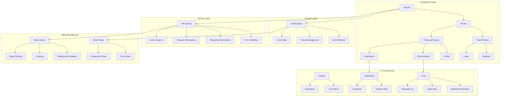
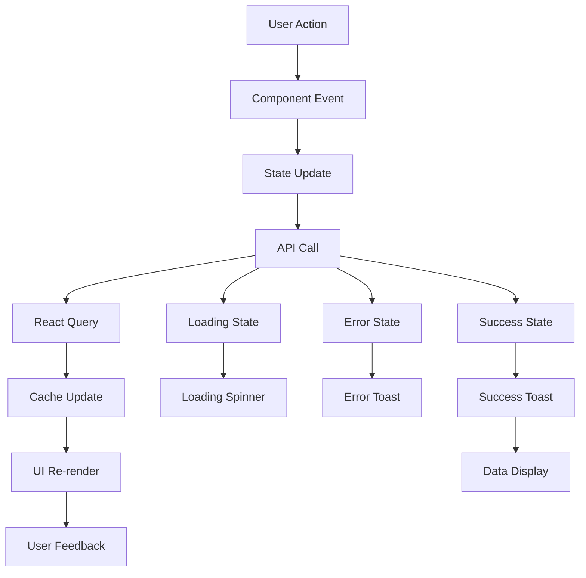
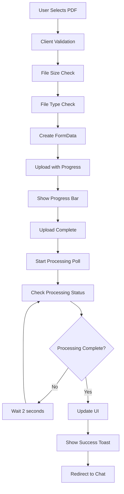
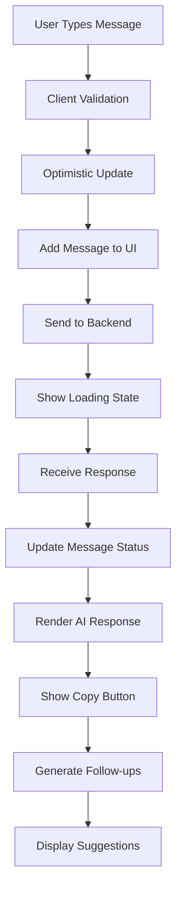
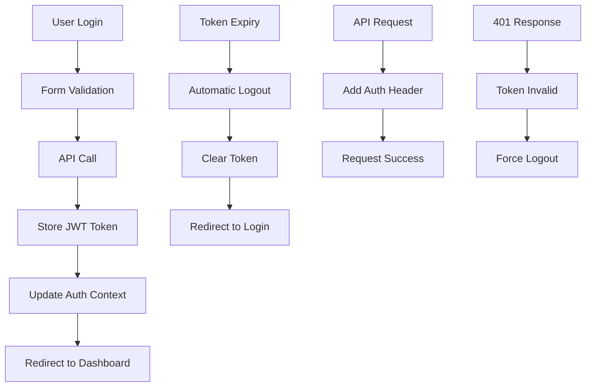

# 🎨 AskMyPDF Frontend

[](https://reactjs.org/)
[](https://www.typescriptlang.org/)
[](https://vitejs.dev/)
[](https://tailwindcss.com/)
[](https://www.framer.com/motion/)

> 🚀 **Modern React frontend with TypeScript, featuring stunning glassmorphism design, Framer Motion animations, real-time chat interface, and intelligent document management built with Vite and Tailwind CSS.**

## 🌟 Features

### 🎨 Modern Glassmorphism UI/UX
- **Glassmorphism Design**: Beautiful backdrop-blur effects and transparency
- **Framer Motion Animations**: Smooth, engaging micro-interactions and transitions
- **Responsive Design**: Mobile-first approach with Tailwind CSS
- **Dark Mode Support**: Adaptive theming with seamless transitions
- **Animated Components**: Custom animated buttons, loading states, and floating elements
- **Glass Cards**: Elegant glassmorphism components throughout the interface
- **Toast Notifications**: Beautiful real-time feedback with react-hot-toast

### 🔐 Authentication & Security
- **JWT-based Auth**: Secure token management with automatic refresh
- **Protected Routes**: Route-level authentication with context management
- **Global Auth State**: React Context for authentication state
- **Auto-logout**: Intelligent token expiration handling
- **Form Validation**: Real-time input validation with visual feedback

### 📄 Advanced Document Management
- **Drag & Drop Upload**: Intuitive file upload with react-dropzone and progress tracking
- **Real-time Progress**: Live upload and processing status updates
- **File Validation**: Client-side file type, size, and format validation
- **Document Gallery**: Beautiful grid layout with animated cards
- **Advanced Search & Filter**: Dynamic document filtering and search capabilities
- **Processing Status**: Visual indicators for document processing states

### 💬 Enhanced Chat Interface
- **Real-time Messaging**: Smooth chat experience with optimistic updates
- **Markdown Support**: Rich text rendering with syntax highlighting
- **Message History**: Persistent conversation history with scroll management
- **Context Awareness**: Intelligent conversation flow management
- **Copy to Clipboard**: Easy message copying with toast feedback
- **AI Engine Status**: Real-time display of current AI engine (Alchemyst/Gemini)
- **Streaming Responses**: Live response rendering as AI generates content

### 🚀 Performance & Optimization
- **Code Splitting**: Lazy loading for optimal performance and faster initial loads
- **React Query**: Intelligent data fetching, caching, and synchronization
- **Optimistic Updates**: Immediate UI feedback for better user experience
- **Bundle Optimization**: Vite's efficient bundling with tree shaking
- **Asset Optimization**: Optimized images, fonts, and static assets
- **Memory Management**: Efficient component lifecycle and cleanup

## 🏗️ Architecture



## 🔄 Component Flow



## 🚀 Getting Started

### Prerequisites
- 📦 Node.js 18+
- 🔧 npm or yarn

### Installation
```bash
cd frontend
npm install
```

### Environment Configuration
Create a `.env` file:
```bash
VITE_API_URL=http://localhost:5000/api
```

### Development Server
```bash
npm run dev
```

### Production Build
```bash
npm run build
npm run preview
```

## 📁 Project Structure

```
frontend/
├── 📁 src/
│   ├── 📄 App.tsx                 # Main app component
│   ├── 📄 main.tsx                # React entry point
│   ├── 📄 index.css               # Global styles
│   ├── 📄 vite-env.d.ts           # Vite type definitions
│   ├── 📁 assets/                 # Static assets
│   │   └── 📄 favicon.svg
│   ├── 📁 components/             # Reusable components
│   │   ├── 📄 FileUpload.tsx      # File upload component
│   │   ├── 📄 Header.tsx          # Navigation header
│   │   ├── 📄 LoadingSpinner.tsx  # Loading animations
│   │   ├── 📄 ProtectedRoute.tsx  # Route protection
│   │   └── 📁 Auth/               # Authentication components
│   │       ├── 📄 LoginForm.tsx
│   │       └── 📄 RegisterForm.tsx
│   ├── 📁 contexts/               # React contexts
│   │   └── 📄 AuthContext.tsx     # Authentication context
│   ├── 📁 pages/                  # Page components
│   │   ├── 📄 Chat.tsx            # Chat interface
│   │   ├── 📄 Dashboard.tsx       # Main dashboard
│   │   ├── 📄 Login.tsx           # Login page
│   │   ├── 📄 Profile.tsx         # User profile
│   │   └── 📄 Register.tsx        # Registration page
│   └── 📁 services/               # API services
│       └── 📄 api.ts              # Axios configuration
├── 📄 index.html                  # HTML template
├── 📄 package.json                # Dependencies
├── 📄 tailwind.config.js          # Tailwind configuration
├── 📄 tsconfig.json               # TypeScript config
└── 📄 vite.config.ts              # Vite configuration
```

## 🎯 Key Components

### 🔐 Authentication Context
```typescript
interface AuthContextType {
  user: User | null;
  token: string | null;
  login: (email: string, password: string) => Promise<void>;
  register: (username: string, email: string, password: string) => Promise<void>;
  logout: () => void;
  loading: boolean;
  error: string | null;
}
```

### 📄 File Upload Component
```typescript
const FileUpload: React.FC<FileUploadProps> = ({ onUploadComplete }) => {
  const [uploading, setUploading] = useState(false);
  const [uploadProgress, setUploadProgress] = useState(0);
  
  const onDrop = useCallback(async (acceptedFiles: File[]) => {
    // Handle file upload with progress tracking
  }, []);
  
  // Drag and drop functionality with react-dropzone
  const { getRootProps, getInputProps, isDragActive } = useDropzone({
    onDrop,
    accept: { 'application/pdf': ['.pdf'] },
    maxSize: 25 * 1024 * 1024, // 25MB
    multiple: false
  });
};
```

### 💬 Chat Interface
```typescript
const Chat: React.FC = () => {
  const [messages, setMessages] = useState<Message[]>([]);
  const [newMessage, setNewMessage] = useState('');
  const [sending, setSending] = useState(false);
  
  const sendMessage = async () => {
    // Send message with optimistic updates
    // Handle real-time responses
    // Update UI immediately
  };
  
  // Markdown rendering with syntax highlighting
  const renderMessage = (content: string) => (
    <ReactMarkdown
      remarkPlugins={[remarkGfm]}
      components={{
        code({ className, children }) {
          return (
            <SyntaxHighlighter
              style={tomorrow}
              language={language}
              PreTag="div"
            >
              {String(children)}
            </SyntaxHighlighter>
          );
        }
      }}
    >
      {content}
    </ReactMarkdown>
  );
};
```

### 🎨 Enhanced Header Component
```typescript
const Header: React.FC = () => {
  const { user, logout } = useAuth();
  const { isDark, toggleTheme } = useTheme();
  const [isMenuOpen, setIsMenuOpen] = useState(false);

  return (
    <motion.header 
      initial={{ y: -100 }}
      animate={{ y: 0 }}
      transition={{ type: "spring", stiffness: 300, damping: 30 }}
      className="sticky top-0 z-50 backdrop-blur-xl bg-white/10 dark:bg-black/10 border-b border-white/20"
    >
      {/* Animated logo with rotating background */}
      <motion.div
        animate={{ rotate: 360 }}
        transition={{ duration: 20, repeat: Infinity, ease: "linear" }}
        className="absolute inset-0 bg-gradient-to-r from-blue-500 to-purple-600 rounded-xl blur-sm opacity-75"
      />
      
      {/* Glassmorphism theme toggle */}
      <motion.button
        whileHover={{ scale: 1.1 }}
        whileTap={{ scale: 0.9 }}
        onClick={toggleTheme}
        className="p-2 rounded-xl bg-white/10 backdrop-blur-sm hover:bg-white/20 transition-all"
      >
        <AnimatePresence mode="wait">
          {isDark ? <Sun /> : <Moon />}
        </AnimatePresence>
      </motion.button>
    </motion.header>
  );
};
```

### 🪟 Glassmorphism UI Components
```typescript
// GlassCard Component
const GlassCard: React.FC = ({ children, className }) => (
  <div className={`
    backdrop-blur-xl bg-white/10 dark:bg-black/10 
    border border-white/20 dark:border-white/10 
    rounded-xl shadow-xl hover:shadow-2xl 
    transition-all duration-300 ${className}
  `}>
    {children}
  </div>
);

// AnimatedButton Component
const AnimatedButton: React.FC = ({ variant = 'primary', children }) => {
  const variants = {
    primary: 'bg-gradient-to-r from-blue-500 to-purple-600 text-white shadow-lg hover:shadow-xl',
    ghost: 'text-gray-700 dark:text-gray-300 hover:bg-white/10 dark:hover:bg-white/5',
    gradient: 'bg-gradient-to-r from-pink-500 via-purple-500 to-indigo-500 text-white'
  };

  return (
    <motion.button
      whileHover={{ scale: 1.05 }}
      whileTap={{ scale: 0.95 }}
      transition={{ type: "spring", stiffness: 400, damping: 17 }}
      className={`${variants[variant]} px-6 py-3 rounded-xl font-medium transition-all`}
    >
      {children}
    </motion.button>
  );
};

// FloatingElements Component
const FloatingElements: React.FC = () => (
  <div className="fixed inset-0 overflow-hidden pointer-events-none">
    {[...Array(6)].map((_, i) => (
      <motion.div
        key={i}
        className="absolute bg-gradient-to-r from-blue-400/10 to-purple-400/10 rounded-full"
        animate={{
          x: [0, 100, 0],
          y: [0, -100, 0],
          scale: [1, 1.2, 1],
        }}
        transition={{
          duration: 10 + i * 2,
          repeat: Infinity,
          ease: "linear"
        }}
        style={{
          width: 200 + i * 50,
          height: 200 + i * 50,
          left: `${i * 20}%`,
          top: `${i * 15}%`,
        }}
      />
    ))}
  </div>
);
```

## 🎨 UI Components

### 🎯 Design System
- **Colors**: Tailwind CSS color palette
- **Typography**: Inter font family
- **Spacing**: Consistent spacing scale
- **Shadows**: Subtle shadow system
- **Animations**: Smooth transitions and hover effects

### 📱 Responsive Design
```css
/* Mobile-first approach */
.container {
  @apply px-4 sm:px-6 lg:px-8;
}

.grid {
  @apply grid grid-cols-1 md:grid-cols-2 lg:grid-cols-3 gap-6;
}

.card {
  @apply bg-white rounded-lg shadow-md hover:shadow-lg transition-shadow;
}
```

### 🔄 Loading States
```typescript
const LoadingSpinner: React.FC = () => (
  <div className="flex items-center justify-center p-8">
    <div className="animate-spin rounded-full h-12 w-12 border-b-2 border-blue-600"></div>
  </div>
);

const SkeletonCard: React.FC = () => (
  <div className="bg-white rounded-lg shadow-md p-6 animate-pulse">
    <div className="h-4 bg-gray-200 rounded w-3/4 mb-4"></div>
    <div className="h-3 bg-gray-200 rounded w-1/2 mb-2"></div>
    <div className="h-3 bg-gray-200 rounded w-2/3"></div>
  </div>
);
```

## 🔧 Configuration

### Vite Configuration
```typescript
export default defineConfig({
  plugins: [react()],
  optimizeDeps: {
    exclude: ['lucide-react'],
  },
  build: {
    outDir: '../backend/public',
    emptyOutDir: true,
  },
  server: {
    proxy: {
      '/api': {
        target: 'http://localhost:5000',
        changeOrigin: true,
      },
    },
  },
});
```

### Tailwind Configuration
```javascript
module.exports = {
  content: [
    "./index.html",
    "./src/**/*.{js,ts,jsx,tsx}",
  ],
  theme: {
    extend: {
      colors: {
        primary: {
          50: '#eff6ff',
          500: '#3b82f6',
          600: '#2563eb',
          700: '#1d4ed8',
        },
      },
      animation: {
        'fade-in': 'fadeIn 0.5s ease-in-out',
        'slide-up': 'slideUp 0.3s ease-out',
      },
    },
  },
  plugins: [],
};
```

## 🚀 State Management

### React Query Setup
```typescript
const queryClient = new QueryClient({
  defaultOptions: {
    queries: {
      retry: 1,
      refetchOnWindowFocus: false,
      staleTime: 5 * 60 * 1000, // 5 minutes
    },
  },
});

function App() {
  return (
    <QueryClientProvider client={queryClient}>
      <AuthProvider>
        <Router>
          <AppContent />
        </Router>
      </AuthProvider>
    </QueryClientProvider>
  );
}
```

### Custom Hooks
```typescript
// Custom hook for API calls
const useDocuments = () => {
  return useQuery('documents', async () => {
    const response = await api.get('/pdf/documents');
    return response.data;
  });
};

// Custom hook for chat functionality
const useChat = (documentId: string) => {
  const [messages, setMessages] = useState<Message[]>([]);
  
  const sendMessage = useMutation(
    (message: string) => api.post(`/chat/${chatId}/message`, { message }),
    {
      onSuccess: (response) => {
        setMessages(prev => [...prev, response.data]);
      },
    }
  );
  
  return { messages, sendMessage };
};
```

## 🎯 Features Deep Dive

### 📄 Document Upload Flow


### 💬 Real-time Chat Flow


### 🔐 Authentication Flow


## 🎨 Styling Guidelines

### Component Styling
```typescript
// Consistent button styles
const Button: React.FC<ButtonProps> = ({ variant = 'primary', size = 'md', children, ...props }) => {
  const baseClasses = 'font-medium rounded-lg transition-colors focus:outline-none focus:ring-2 focus:ring-offset-2';
  
  const variants = {
    primary: 'bg-blue-600 text-white hover:bg-blue-700 focus:ring-blue-500',
    secondary: 'bg-gray-200 text-gray-900 hover:bg-gray-300 focus:ring-gray-500',
    danger: 'bg-red-600 text-white hover:bg-red-700 focus:ring-red-500',
  };
  
  const sizes = {
    sm: 'px-3 py-1.5 text-sm',
    md: 'px-4 py-2 text-base',
    lg: 'px-6 py-3 text-lg',
  };
  
  return (
    <button
      className={`${baseClasses} ${variants[variant]} ${sizes[size]}`}
      {...props}
    >
      {children}
    </button>
  );
};
```

### Layout Patterns
```typescript
// Consistent layout wrapper
const Layout: React.FC<{ children: React.ReactNode }> = ({ children }) => (
  <div className="min-h-screen bg-gradient-to-br from-slate-50 to-blue-50">
    <Header />
    <main className="container mx-auto px-4 py-8">
      {children}
    </main>
  </div>
);

// Card component for consistent styling
const Card: React.FC<CardProps> = ({ children, className = '', ...props }) => (
  <div 
    className={`bg-white rounded-lg shadow-md hover:shadow-lg transition-shadow p-6 ${className}`}
    {...props}
  >
    {children}
  </div>
);
```

## 🔄 Performance Optimization

### Code Splitting
```typescript
// Lazy loading for routes
const Dashboard = lazy(() => import('./pages/Dashboard'));
const Chat = lazy(() => import('./pages/Chat'));
const Profile = lazy(() => import('./pages/Profile'));

// Suspense wrapper
<Suspense fallback={<LoadingSpinner />}>
  <Routes>
    <Route path="/dashboard" element={<Dashboard />} />
    <Route path="/chat/:documentId" element={<Chat />} />
    <Route path="/profile" element={<Profile />} />
  </Routes>
</Suspense>
```

### React Query Optimization
```typescript
// Prefetching for better UX
const prefetchDocuments = () => {
  queryClient.prefetchQuery('documents', fetchDocuments);
};

// Background updates
const { data, isLoading } = useQuery(
  'documents',
  fetchDocuments,
  {
    staleTime: 5 * 60 * 1000,
    cacheTime: 10 * 60 * 1000,
    refetchOnWindowFocus: false,
    refetchOnMount: false,
  }
);
```

## 🧪 Testing

### Component Testing
```typescript
// Example test for FileUpload component
describe('FileUpload', () => {
  it('should handle file drop', async () => {
    render(<FileUpload onUploadComplete={mockCallback} />);
    
    const dropzone = screen.getByTestId('dropzone');
    const file = new File(['dummy content'], 'test.pdf', { type: 'application/pdf' });
    
    fireEvent.drop(dropzone, { dataTransfer: { files: [file] } });
    
    await waitFor(() => {
      expect(screen.getByText('Uploading...')).toBeInTheDocument();
    });
  });
});
```

### E2E Testing
```typescript
// Cypress test example
describe('Document Upload Flow', () => {
  it('should upload and process a PDF', () => {
    cy.visit('/dashboard');
    cy.fixture('test-document.pdf').then((file) => {
      cy.get('[data-testid="file-upload"]').attachFile(file);
      cy.get('[data-testid="upload-progress"]').should('be.visible');
      cy.get('[data-testid="processing-status"]').should('contain', 'Processing...');
      cy.get('[data-testid="chat-button"]').should('be.enabled');
    });
  });
});
```

## 🚀 Deployment

### Build Process
```bash
# Install dependencies
npm install

# Build for production
npm run build

# Preview build
npm run preview
```

### Environment Variables
```bash
# Production
VITE_API_URL=https://api.askmypdf.com

# Development
VITE_API_URL=http://localhost:5000/api
```

### Static Hosting
```bash
# Deploy to Netlify
npm run build
netlify deploy --prod --dir=dist

# Deploy to Vercel
npm run build
vercel --prod
```

## 📊 Analytics & Monitoring

### Error Tracking
```typescript
// Error boundary for graceful error handling
class ErrorBoundary extends React.Component<Props, State> {
  constructor(props: Props) {
    super(props);
    this.state = { hasError: false };
  }
  
  static getDerivedStateFromError(error: Error): State {
    return { hasError: true };
  }
  
  componentDidCatch(error: Error, errorInfo: ErrorInfo) {
    console.error('Error caught by boundary:', error, errorInfo);
    // Send to error tracking service
  }
  
  render() {
    if (this.state.hasError) {
      return <ErrorFallback />;
    }
    return this.props.children;
  }
}
```

### Performance Monitoring
```typescript
// Web Vitals tracking
import { getCLS, getFID, getFCP, getLCP, getTTFB } from 'web-vitals';

const sendToAnalytics = (metric: any) => {
  // Send metrics to analytics service
  console.log(metric);
};

getCLS(sendToAnalytics);
getFID(sendToAnalytics);
getFCP(sendToAnalytics);
getLCP(sendToAnalytics);
getTTFB(sendToAnalytics);
```

## 🎯 Best Practices

### Component Organization
- **Single Responsibility**: Each component has one clear purpose
- **Prop Interfaces**: TypeScript interfaces for all props
- **Custom Hooks**: Extract complex logic into reusable hooks
- **Error Boundaries**: Graceful error handling
- **Loading States**: Consistent loading indicators

### Code Quality
- **TypeScript**: Strict type checking
- **ESLint**: Code linting and formatting
- **Prettier**: Code formatting
- **Husky**: Git hooks for quality gates
- **Testing**: Unit and integration tests

## 🤝 Contributing

1. Fork the repository
2. Create a feature branch
3. Follow TypeScript and React best practices
4. Write tests for new features
5. Submit pull request

## � Support & Contact

For support or questions about the frontend:

- 📧 **Email**: [sakshamsinghrathore1304@gmail.com](mailto:sakshamsinghrathore1304@gmail.com)
- 💼 **LinkedIn**: [Saksham Singh Rathore](https://www.linkedin.com/in/saksham-singh-rathore1304/)
- 🐛 **Issues**: Found a bug or have a feature request? Please [open an issue](https://github.com/saksham-1304/AskMyPDF/issues) on GitHub
- 💡 **Discussions**: Join the conversation in our [GitHub Discussions](https://github.com/saksham-1304/AskMyPDF/discussions)

## �📄 License

MIT License - see LICENSE file for details.

---

<div align="center">
  <strong>🚀 Built with React, TypeScript, and modern frontend technologies</strong>
</div>
