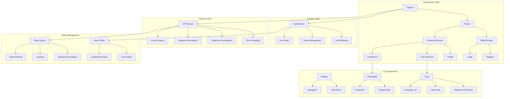
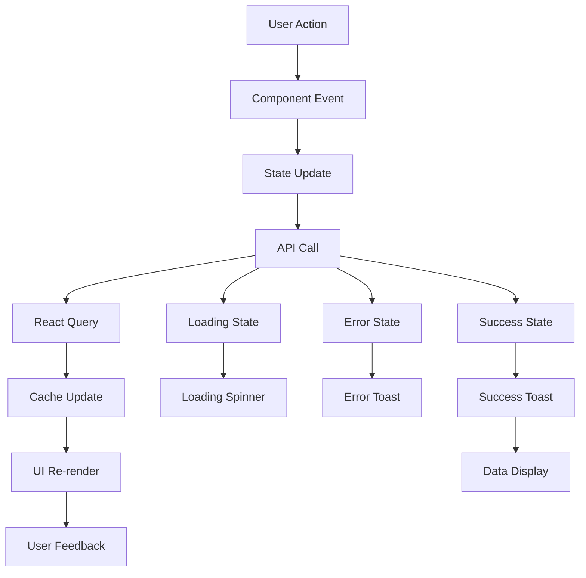
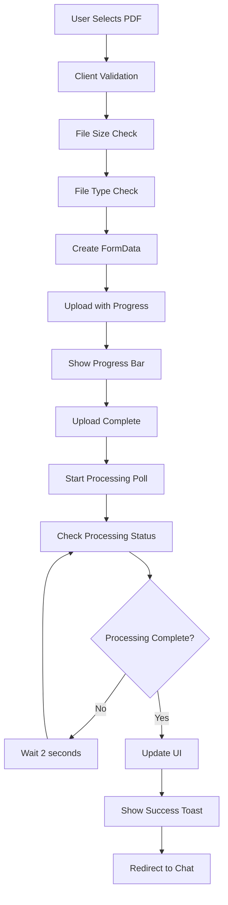
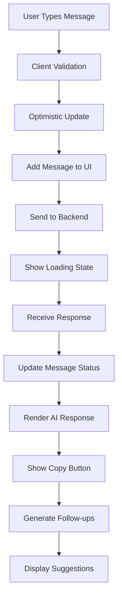
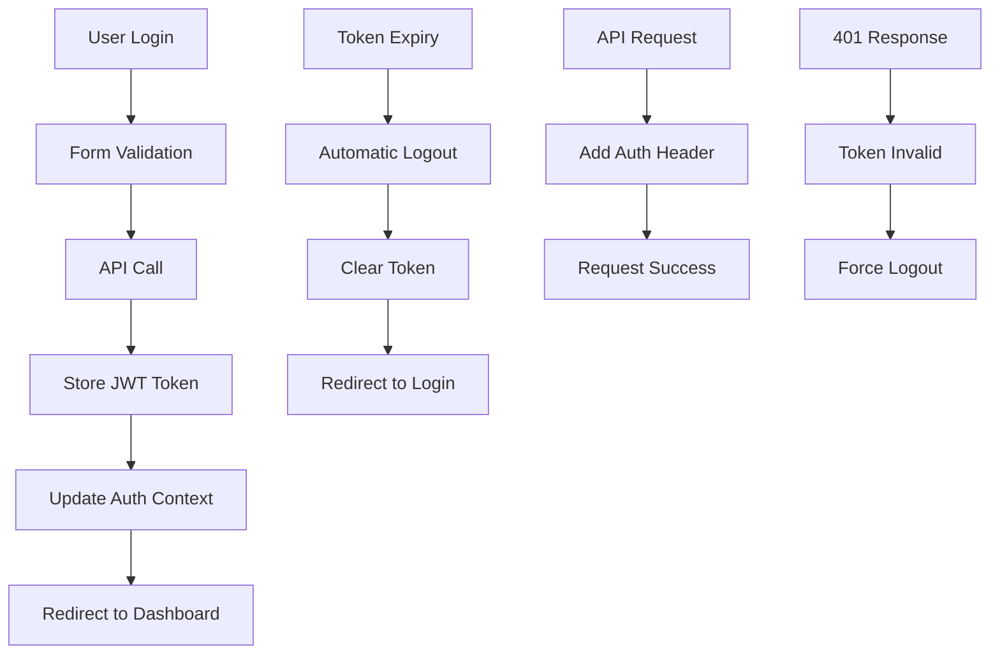

# 🎨 AskMyPDF Frontend

[](https://reactjs.org/)
[](https://www.typescriptlang.org/)
[](https://vitejs.dev/)
[](https://tailwindcss.com/)

> 🚀 **Modern React frontend with TypeScript, featuring a beautiful responsive UI, real-time chat interface, and intelligent document management built with Vite and Tailwind CSS.**

## 🌟 Features

### 🎨 Modern UI/UX
- **Responsive Design**: Mobile-first approach with Tailwind CSS
- **Glassmorphism**: Modern design with glass effects
- **Dark Mode Ready**: Adaptive color schemes
- **Loading States**: Smooth loading animations and skeletons
- **Toast Notifications**: Real-time feedback with react-hot-toast

### 🔐 Authentication
- **JWT-based Auth**: Secure token management
- **Protected Routes**: Route-level authentication
- **Context Management**: Global auth state
- **Auto-logout**: Token expiration handling
- **Form Validation**: Real-time input validation

### 📄 Document Management
- **Drag & Drop**: Intuitive file upload with react-dropzone
- **Progress Tracking**: Real-time upload and processing progress
- **File Validation**: Client-side file type and size validation
- **Document Gallery**: Beautiful grid layout for documents
- **Search & Filter**: Advanced document filtering

### 💬 Chat Interface
- **Real-time Chat**: Smooth messaging experience
- **Markdown Support**: Rich text rendering with code highlighting
- **Message History**: Persistent conversation history
- **Context Awareness**: Conversation flow management
- **Copy to Clipboard**: Easy message copying

### 🚀 Performance
- **Code Splitting**: Lazy loading for optimal performance
- **React Query**: Intelligent data fetching and caching
- **Optimistic Updates**: Immediate UI feedback
- **Bundle Optimization**: Vite's efficient bundling
- **Tree Shaking**: Unused code elimination

## 🏗️ Architecture



## 🔄 Component Flow



## 🚀 Getting Started

### Prerequisites
- 📦 Node.js 18+
- 🔧 npm or yarn

### Installation
```bash
cd frontend
npm install
```

### Environment Configuration
Create a `.env` file:
```bash
VITE_API_URL=http://localhost:5000/api
```

### Development Server
```bash
npm run dev
```

### Production Build
```bash
npm run build
npm run preview
```

## 📁 Project Structure

```
frontend/
├── 📁 src/
│   ├── 📄 App.tsx                 # Main app component
│   ├── 📄 main.tsx                # React entry point
│   ├── 📄 index.css               # Global styles
│   ├── 📄 vite-env.d.ts           # Vite type definitions
│   ├── 📁 assets/                 # Static assets
│   │   └── 📄 favicon.svg
│   ├── 📁 components/             # Reusable components
│   │   ├── 📄 FileUpload.tsx      # File upload component
│   │   ├── 📄 Header.tsx          # Navigation header
│   │   ├── 📄 LoadingSpinner.tsx  # Loading animations
│   │   ├── 📄 ProtectedRoute.tsx  # Route protection
│   │   └── 📁 Auth/               # Authentication components
│   │       ├── 📄 LoginForm.tsx
│   │       └── 📄 RegisterForm.tsx
│   ├── 📁 contexts/               # React contexts
│   │   └── 📄 AuthContext.tsx     # Authentication context
│   ├── 📁 pages/                  # Page components
│   │   ├── 📄 Chat.tsx            # Chat interface
│   │   ├── 📄 Dashboard.tsx       # Main dashboard
│   │   ├── 📄 Login.tsx           # Login page
│   │   ├── 📄 Profile.tsx         # User profile
│   │   └── 📄 Register.tsx        # Registration page
│   └── 📁 services/               # API services
│       └── 📄 api.ts              # Axios configuration
├── 📄 index.html                  # HTML template
├── 📄 package.json                # Dependencies
├── 📄 tailwind.config.js          # Tailwind configuration
├── 📄 tsconfig.json               # TypeScript config
└── 📄 vite.config.ts              # Vite configuration
```

## 🎯 Key Components

### 🔐 Authentication Context
```typescript
interface AuthContextType {
  user: User | null;
  token: string | null;
  login: (email: string, password: string) => Promise<void>;
  register: (username: string, email: string, password: string) => Promise<void>;
  logout: () => void;
  loading: boolean;
  error: string | null;
}
```

### 📄 File Upload Component
```typescript
const FileUpload: React.FC<FileUploadProps> = ({ onUploadComplete }) => {
  const [uploading, setUploading] = useState(false);
  const [uploadProgress, setUploadProgress] = useState(0);
  
  const onDrop = useCallback(async (acceptedFiles: File[]) => {
    // Handle file upload with progress tracking
  }, []);
  
  // Drag and drop functionality with react-dropzone
  const { getRootProps, getInputProps, isDragActive } = useDropzone({
    onDrop,
    accept: { 'application/pdf': ['.pdf'] },
    maxSize: 25 * 1024 * 1024, // 25MB
    multiple: false
  });
};
```

### 💬 Chat Interface
```typescript
const Chat: React.FC = () => {
  const [messages, setMessages] = useState<Message[]>([]);
  const [newMessage, setNewMessage] = useState('');
  const [sending, setSending] = useState(false);
  
  const sendMessage = async () => {
    // Send message with optimistic updates
    // Handle real-time responses
    // Update UI immediately
  };
  
  // Markdown rendering with syntax highlighting
  const renderMessage = (content: string) => (
    <ReactMarkdown
      remarkPlugins={[remarkGfm]}
      components={{
        code({ className, children }) {
          return (
            <SyntaxHighlighter
              style={tomorrow}
              language={language}
              PreTag="div"
            >
              {String(children)}
            </SyntaxHighlighter>
          );
        }
      }}
    >
      {content}
    </ReactMarkdown>
  );
};
```

### 📊 Dashboard Component
```typescript
const Dashboard: React.FC = () => {
  const [documents, setDocuments] = useState<Document[]>([]);
  const [loading, setLoading] = useState(true);
  const [searchTerm, setSearchTerm] = useState('');
  const [filter, setFilter] = useState('all');
  
  // React Query for data fetching
  const { data: documents, isLoading, error } = useQuery(
    'documents',
    () => api.get('/pdf/documents'),
    {
      refetchOnWindowFocus: false,
      staleTime: 5 * 60 * 1000, // 5 minutes
    }
  );
  
  // Filtered documents based on search and filter
  const filteredDocuments = useMemo(() => {
    return documents?.filter(doc => 
      doc.originalName.toLowerCase().includes(searchTerm.toLowerCase()) &&
      (filter === 'all' || doc.processingStatus === filter)
    ) || [];
  }, [documents, searchTerm, filter]);
};
```

## 🎨 UI Components

### 🎯 Design System
- **Colors**: Tailwind CSS color palette
- **Typography**: Inter font family
- **Spacing**: Consistent spacing scale
- **Shadows**: Subtle shadow system
- **Animations**: Smooth transitions and hover effects

### 📱 Responsive Design
```css
/* Mobile-first approach */
.container {
  @apply px-4 sm:px-6 lg:px-8;
}

.grid {
  @apply grid grid-cols-1 md:grid-cols-2 lg:grid-cols-3 gap-6;
}

.card {
  @apply bg-white rounded-lg shadow-md hover:shadow-lg transition-shadow;
}
```

### 🔄 Loading States
```typescript
const LoadingSpinner: React.FC = () => (
  <div className="flex items-center justify-center p-8">
    <div className="animate-spin rounded-full h-12 w-12 border-b-2 border-blue-600"></div>
  </div>
);

const SkeletonCard: React.FC = () => (
  <div className="bg-white rounded-lg shadow-md p-6 animate-pulse">
    <div className="h-4 bg-gray-200 rounded w-3/4 mb-4"></div>
    <div className="h-3 bg-gray-200 rounded w-1/2 mb-2"></div>
    <div className="h-3 bg-gray-200 rounded w-2/3"></div>
  </div>
);
```

## 🔧 Configuration

### Vite Configuration
```typescript
export default defineConfig({
  plugins: [react()],
  optimizeDeps: {
    exclude: ['lucide-react'],
  },
  build: {
    outDir: '../backend/public',
    emptyOutDir: true,
  },
  server: {
    proxy: {
      '/api': {
        target: 'http://localhost:5000',
        changeOrigin: true,
      },
    },
  },
});
```

### Tailwind Configuration
```javascript
module.exports = {
  content: [
    "./index.html",
    "./src/**/*.{js,ts,jsx,tsx}",
  ],
  theme: {
    extend: {
      colors: {
        primary: {
          50: '#eff6ff',
          500: '#3b82f6',
          600: '#2563eb',
          700: '#1d4ed8',
        },
      },
      animation: {
        'fade-in': 'fadeIn 0.5s ease-in-out',
        'slide-up': 'slideUp 0.3s ease-out',
      },
    },
  },
  plugins: [],
};
```

## 🚀 State Management

### React Query Setup
```typescript
const queryClient = new QueryClient({
  defaultOptions: {
    queries: {
      retry: 1,
      refetchOnWindowFocus: false,
      staleTime: 5 * 60 * 1000, // 5 minutes
    },
  },
});

function App() {
  return (
    <QueryClientProvider client={queryClient}>
      <AuthProvider>
        <Router>
          <AppContent />
        </Router>
      </AuthProvider>
    </QueryClientProvider>
  );
}
```

### Custom Hooks
```typescript
// Custom hook for API calls
const useDocuments = () => {
  return useQuery('documents', async () => {
    const response = await api.get('/pdf/documents');
    return response.data;
  });
};

// Custom hook for chat functionality
const useChat = (documentId: string) => {
  const [messages, setMessages] = useState<Message[]>([]);
  
  const sendMessage = useMutation(
    (message: string) => api.post(`/chat/${chatId}/message`, { message }),
    {
      onSuccess: (response) => {
        setMessages(prev => [...prev, response.data]);
      },
    }
  );
  
  return { messages, sendMessage };
};
```

## 🎯 Features Deep Dive

### 📄 Document Upload Flow


### 💬 Real-time Chat Flow


### 🔐 Authentication Flow


## 🎨 Styling Guidelines

### Component Styling
```typescript
// Consistent button styles
const Button: React.FC<ButtonProps> = ({ variant = 'primary', size = 'md', children, ...props }) => {
  const baseClasses = 'font-medium rounded-lg transition-colors focus:outline-none focus:ring-2 focus:ring-offset-2';
  
  const variants = {
    primary: 'bg-blue-600 text-white hover:bg-blue-700 focus:ring-blue-500',
    secondary: 'bg-gray-200 text-gray-900 hover:bg-gray-300 focus:ring-gray-500',
    danger: 'bg-red-600 text-white hover:bg-red-700 focus:ring-red-500',
  };
  
  const sizes = {
    sm: 'px-3 py-1.5 text-sm',
    md: 'px-4 py-2 text-base',
    lg: 'px-6 py-3 text-lg',
  };
  
  return (
    <button
      className={`${baseClasses} ${variants[variant]} ${sizes[size]}`}
      {...props}
    >
      {children}
    </button>
  );
};
```

### Layout Patterns
```typescript
// Consistent layout wrapper
const Layout: React.FC<{ children: React.ReactNode }> = ({ children }) => (
  <div className="min-h-screen bg-gradient-to-br from-slate-50 to-blue-50">
    <Header />
    <main className="container mx-auto px-4 py-8">
      {children}
    </main>
  </div>
);

// Card component for consistent styling
const Card: React.FC<CardProps> = ({ children, className = '', ...props }) => (
  <div 
    className={`bg-white rounded-lg shadow-md hover:shadow-lg transition-shadow p-6 ${className}`}
    {...props}
  >
    {children}
  </div>
);
```

## 🔄 Performance Optimization

### Code Splitting
```typescript
// Lazy loading for routes
const Dashboard = lazy(() => import('./pages/Dashboard'));
const Chat = lazy(() => import('./pages/Chat'));
const Profile = lazy(() => import('./pages/Profile'));

// Suspense wrapper
<Suspense fallback={<LoadingSpinner />}>
  <Routes>
    <Route path="/dashboard" element={<Dashboard />} />
    <Route path="/chat/:documentId" element={<Chat />} />
    <Route path="/profile" element={<Profile />} />
  </Routes>
</Suspense>
```

### React Query Optimization
```typescript
// Prefetching for better UX
const prefetchDocuments = () => {
  queryClient.prefetchQuery('documents', fetchDocuments);
};

// Background updates
const { data, isLoading } = useQuery(
  'documents',
  fetchDocuments,
  {
    staleTime: 5 * 60 * 1000,
    cacheTime: 10 * 60 * 1000,
    refetchOnWindowFocus: false,
    refetchOnMount: false,
  }
);
```

## 🧪 Testing

### Component Testing
```typescript
// Example test for FileUpload component
describe('FileUpload', () => {
  it('should handle file drop', async () => {
    render(<FileUpload onUploadComplete={mockCallback} />);
    
    const dropzone = screen.getByTestId('dropzone');
    const file = new File(['dummy content'], 'test.pdf', { type: 'application/pdf' });
    
    fireEvent.drop(dropzone, { dataTransfer: { files: [file] } });
    
    await waitFor(() => {
      expect(screen.getByText('Uploading...')).toBeInTheDocument();
    });
  });
});
```

### E2E Testing
```typescript
// Cypress test example
describe('Document Upload Flow', () => {
  it('should upload and process a PDF', () => {
    cy.visit('/dashboard');
    cy.fixture('test-document.pdf').then((file) => {
      cy.get('[data-testid="file-upload"]').attachFile(file);
      cy.get('[data-testid="upload-progress"]').should('be.visible');
      cy.get('[data-testid="processing-status"]').should('contain', 'Processing...');
      cy.get('[data-testid="chat-button"]').should('be.enabled');
    });
  });
});
```

## 🚀 Deployment

### Build Process
```bash
# Install dependencies
npm install

# Build for production
npm run build

# Preview build
npm run preview
```

### Environment Variables
```bash
# Production
VITE_API_URL=https://api.askmypdf.com

# Development
VITE_API_URL=http://localhost:5000/api
```

### Static Hosting
```bash
# Deploy to Netlify
npm run build
netlify deploy --prod --dir=dist

# Deploy to Vercel
npm run build
vercel --prod
```

## 📊 Analytics & Monitoring

### Error Tracking
```typescript
// Error boundary for graceful error handling
class ErrorBoundary extends React.Component<Props, State> {
  constructor(props: Props) {
    super(props);
    this.state = { hasError: false };
  }
  
  static getDerivedStateFromError(error: Error): State {
    return { hasError: true };
  }
  
  componentDidCatch(error: Error, errorInfo: ErrorInfo) {
    console.error('Error caught by boundary:', error, errorInfo);
    // Send to error tracking service
  }
  
  render() {
    if (this.state.hasError) {
      return <ErrorFallback />;
    }
    return this.props.children;
  }
}
```

### Performance Monitoring
```typescript
// Web Vitals tracking
import { getCLS, getFID, getFCP, getLCP, getTTFB } from 'web-vitals';

const sendToAnalytics = (metric: any) => {
  // Send metrics to analytics service
  console.log(metric);
};

getCLS(sendToAnalytics);
getFID(sendToAnalytics);
getFCP(sendToAnalytics);
getLCP(sendToAnalytics);
getTTFB(sendToAnalytics);
```

## 🎯 Best Practices

### Component Organization
- **Single Responsibility**: Each component has one clear purpose
- **Prop Interfaces**: TypeScript interfaces for all props
- **Custom Hooks**: Extract complex logic into reusable hooks
- **Error Boundaries**: Graceful error handling
- **Loading States**: Consistent loading indicators

### Code Quality
- **TypeScript**: Strict type checking
- **ESLint**: Code linting and formatting
- **Prettier**: Code formatting
- **Husky**: Git hooks for quality gates
- **Testing**: Unit and integration tests

## 🤝 Contributing

1. Fork the repository
2. Create a feature branch
3. Follow TypeScript and React best practices
4. Write tests for new features
5. Submit pull request

## 📄 License

MIT License - see LICENSE file for details.

---

<div align="center">
  <strong>🚀 Built with React, TypeScript, and modern frontend technologies</strong>
</div>
